```
 ~ $ ./profile.sh

 ┌───────────────────────────────────────────┐
 │  ujo4eva — developer                      │
 ├───────────────────────────────────────────┤
 │  OS .......... Omarchy                    │
 │  Shell ....... FISH                       │
 │  WM .......... Hyprland                   │
 │  Editor ...... Zed, Neovim                │
 │                                           │
 │  Languages ... Rust, TypeScript, Java     │
 │  Tools ....... Linux, Emulation, Web      │
 │                                           │
 │  Projects:                                │
 │    chip-8         CHIP-8 emulator         │
 │    toodoo         CLI task tracker        │
 │    lightmap       IoT power tracker       │
 │    score-server   Game score backend      │
 └───────────────────────────────────────────┘

 ~ $ █
```

<picture>
  <source
    srcset="./profile/stats-dark.svg"
    media="(prefers-color-scheme: dark)"
  />
  <source
    srcset="./profile/stats-light.svg"
    media="(prefers-color-scheme: light)"
  />
  
</picture>

<picture>
  <source
    srcset="./profile/top-langs-dark.svg"
    media="(prefers-color-scheme: dark)"
  />
  <source
    srcset="./profile/top-langs-light.svg"
    media="(prefers-color-scheme: light)"
  />
  
</picture>
```
